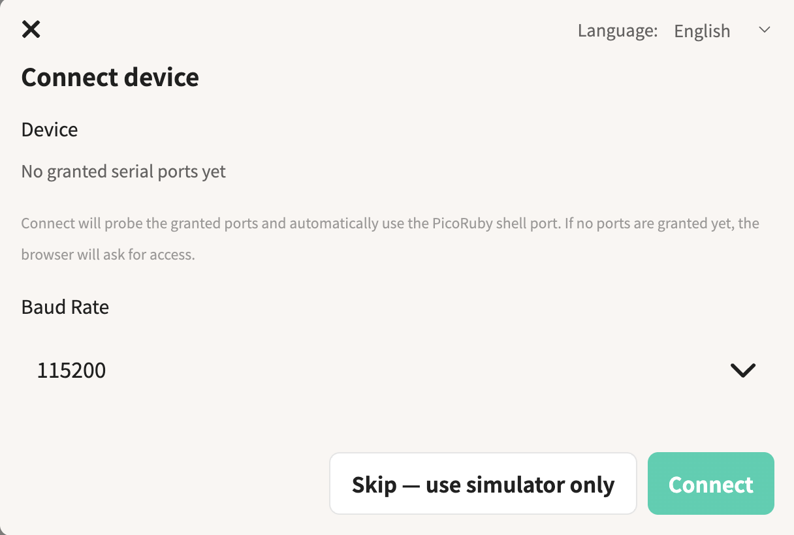
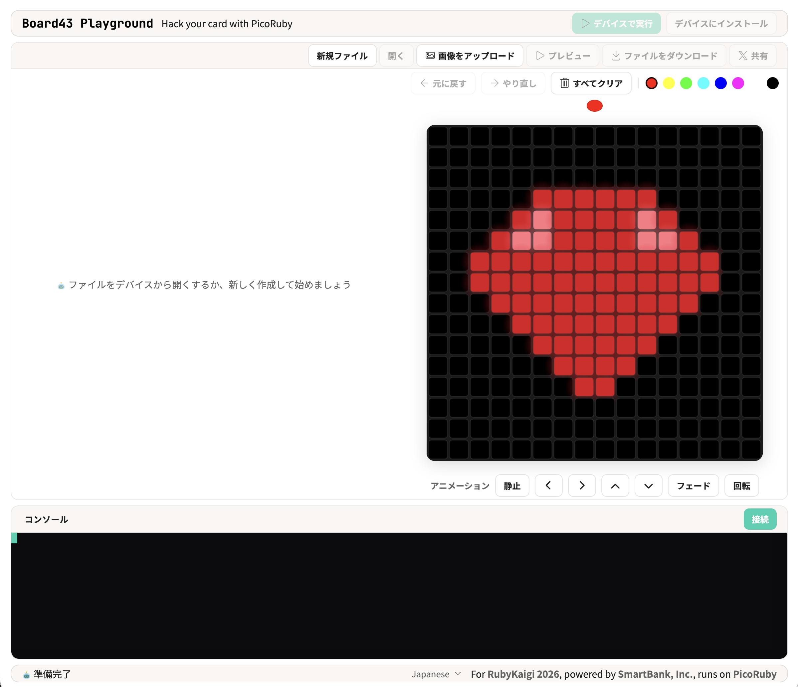
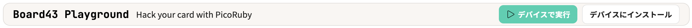
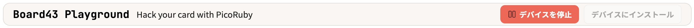
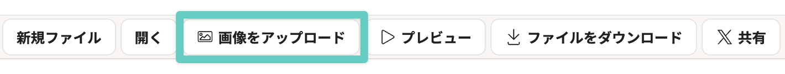
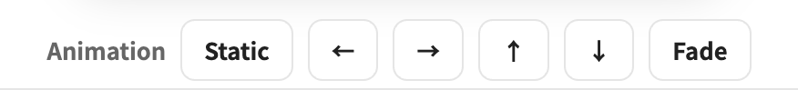
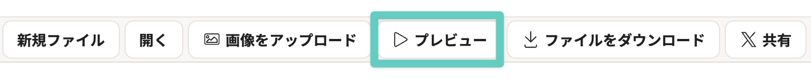

[English](README_en.md)

# Board43 ワークショップ: 自分のアイコンをLEDマトリクスに表示しよう

Board43とPicoRubyを使って、16×16のLEDマトリクスにドット絵で表示させます。

## 使うもの

- **Board43** — ワークショップ後はお持ち帰りいただけます
- **USBケーブル Type-C** — ワークショップ後にお戻しください
- **ご自身のPC** — Chrome または Edge を使います

---

## 1. ツールを立ち上げる

### 1-1. Board43をPCに接続する

USBケーブルでBoard43をPCにつなぎます。

### 1-2. Board43 Playgroundを開く

ブラウザで以下のURLにアクセスします。

```
https://board43-playground.smartbank.workers.dev/
```

### 1-3. シリアル接続する

セットアップ画面が表示されます。

1. Baud Rate は **115200** のまま、 **Connect** ボタンを押す

    

2. ブラウザのダイアログでシリアルポートを選ぶ（「PicoRuby R2P2」と表示されるものを選んでください）

    
    
画面が切り替わり、左にコードエディタ、右上にLEDシミュレータ、下にコンソールが表示されます。




---

## 2. LEDを光らせてみよう

### 2-1. 全部赤く光らせる

エディタに以下のコードを入力します。

```ruby
require 'ws2812-plus'

led = WS2812.new(pin: Board43::GPIO_LEDOUT, num: 256)  # GPIO 24, LED 256個（16×16）
led.fill(255, 0, 0)   # 全LEDを赤（R=255, G=0, B=0）に
led.show              # バッファの内容をLEDに送信
```

画面上部の **Run on Device** ボタンを押してください。



LEDマトリクスが全面赤く光れば成功です。

次のコードを実行する前に **Stop on Device** を押してください。




### 2-2. 好きな場所の色を変える

`set_rgb(index, r, g, b)` で個別のLEDを指定できます。

```ruby
require 'ws2812-plus'

led = WS2812.new(pin: Board43::GPIO_LEDOUT, num: 256)

led.set_rgb(0, 0, 255, 0)      # 左上を緑に
led.set_rgb(15, 0, 0, 255)     # 右上を青に
led.set_rgb(100, 255, 255, 0)  # 100番目を黄色に

led.show
```

LEDのインデックスは左上が `0` で、左から右・上から下の順に並んでいます。

```
  0   1   2   3  ...  15
 16  17  18  19  ...  31
 32  33  34  35  ...  47
  :                    :
240 241 242 243  ... 255
```

---

## 3. アニメーションさせよう

`clear` で全消灯、`sleep_ms` でミリ秒単位の待機ができます。`loop` で「消灯→点灯→待機」を繰り返すことでアニメーションになります。

```ruby
require 'ws2812-plus'

led = WS2812.new(pin: Board43::GPIO_LEDOUT, num: 256)

loop do
  256.times do |i|
    led.clear                   # 全LED消灯
    led.set_rgb(i, 255, 0, 0)   # i番目を赤く光らせる
    led.show
    sleep_ms 30                 # 30ミリ秒待つ
  end
end
```

**Run on Device** で実行すると、赤い光が左上から右下へ流れていきます。

`sleep_ms` の値がフレーム間隔になるので、値を小さくすると速く、大きくするとゆっくり流れます。

プログラムを止めるときは画面上部の **Stop on Device** ボタンを押してください。

---

## 4. 自分のアイコンを光らせよう

ここからがメインです。画面右上の **LEDシミュレータ** を使ってドット絵を作り、Board43に表示させます。

### 4-1. 画像をアップロードする

1. エディタのツールバーにある **Upload image** ボタンを押す

    

2. 画像ファイルを選択する
3. 自動的に16×16に変換されてシミュレータに表示される


### 4-2. アニメーションをつける

シミュレータのツールバーで、表示方法を選べます。



| 選択肢 | 動き |
| --- | --- |
| Static | 静止表示 |
| ← | 左にスクロール |
| → | 右にスクロール |
| ↑ | 上にスクロール |
| ↓ | 下にスクロール |
| Fade | フェードイン・アウト |

### 4-3. シミュレータで確認する

エディタの **Preview** ボタンを押すと、コードが自動生成され、アニメーションがシミュレータ上でプレビューできます。



### 4-4. Board43に転送して光らせる

画面上部の **Run on Device** ボタンを押すと、Board43のLEDマトリクスに表示されます。

### 4-5. ボードを傾けてみよう

Board43を上下にひっくり返してみてください。アイコンの向きが自動的に変わります。アップロードした画像から生成されるコードには、加速度センサーで上下を検知する処理が含まれています。

### 4-6. 自由に試してみよう

ドット絵やアニメーションを変えて、何度でも試せます。納得いくまでいろいろ試してみてください。

### 4-7. 電源を入れただけでコードを実行する

画面上部の **Install on Device** ボタンを押すと、現在のコードが `/home/app.rb` として保存され、次回から電源を入れるだけでLEDが光ります。PCに接続しなくても、モバイルバッテリーで動きます。起動時にステータスLEDが10回点滅したあとに app.rb が実行されます。

自動起動を解除したい場合は、自動起動をスキップしてから app.rb を削除・変更します。

1. 基板の **SW3** ボタンを押したまま **RUN** ボタンを押して再起動する
2. ステータスLEDが3回フラッシュするまで **SW3** ボタンを押したままにする
3. Playground画面で **Connect** を押し直し、コンソールから app.rb を削除または別名に変更する

```
mv /home/app.rb /home/old.rb
```

### 4-8. コードをシェアしよう

エディタツールバーの **Share** ボタンを押すと、共有用のURLが生成されます。リンクをコピーしたり、X（Twitter）に投稿できます。共有リンクを開くと、Board43 Playgroundにコードが展開されます。

---

## 5. Board43でできること

Board43にはLEDマトリクス以外にも、6軸IMU（加速度・ジャイロセンサー）、ブザー、スイッチが搭載されています。

**デモ: テルミン（theremin.rb）**
ボードを傾けて音階を演奏できます。LEDが現在の音の位置を表示します。IMU、ブザー、LED、スイッチを使っています。

このサンプルコードはGitHubで公開しています。ご自身のBoard43でぜひ試してみてください。

https://github.com/smartbank-inc/Board43/workshop/examples

### その他の機能

**エディタのツールバー**

| ボタン | 説明 |
| --- | --- |
| New File | 新しいファイルを作成する |
| Open | Board43に保存されているファイルを開く |
| Download | 現在のファイルをPCに保存する |

**コンソール**

コンソールはPicoRubyのシェルです。ターミナルから直接コマンドを実行できます。

```
/home/my_program.rb   # ファイルを指定して実行
```

実行中のプログラムは **Ctrl + C** で停止できます。

```
ls /home          # ファイル一覧
cat /home/app.rb  # ファイルの中身を表示
mv /home/app.rb /home/old.rb  # ファイル名の変更
```

---

## 6. 片付け

USBケーブルを外して、机の上に置いてください。Board43はお持ち帰りください。

[アンケート](https://docs.google.com/forms/d/e/1FAIpQLSeV5AyQW6vzZo-vfc9GZmv4xTpa_p-nzMFEPl0KW-F13QeOgA/viewform)にご協力ください。今後のワークショップの参考にさせていただきます。

ワークショップ後もこのハックスペースにいます。できたものを見せに来てもらえるとうれしいです。質問もお気軽にどうぞ。

SNSでのシェアも大歓迎です。 **#board43** をつけてもらえると見に行けるのでうれしいです。

---

## トラブルシューティング

**LEDが光らない**
→ USBケーブルがしっかり接続されているか確認してください。コンソールに `>` が表示されていれば接続は正常です。

**プログラムが止まらない**
→ 画面上部の **Stop on Device** ボタンを押してください。

**シリアルポートが見つからない**
→ Chrome または Edge を使っているか確認してください。Firefox や Safari は Web Serial API に対応していません。

**画面が固まった**
→ ブラウザをリロードして、再度 Connect してください。

---

## License

[CC BY-SA 4.0](https://creativecommons.org/licenses/by-sa/4.0/), Attribution-ShareAlike 4.0 International.
