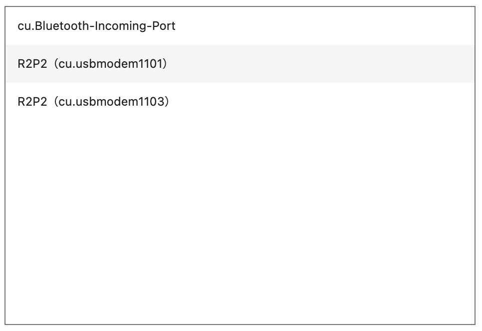
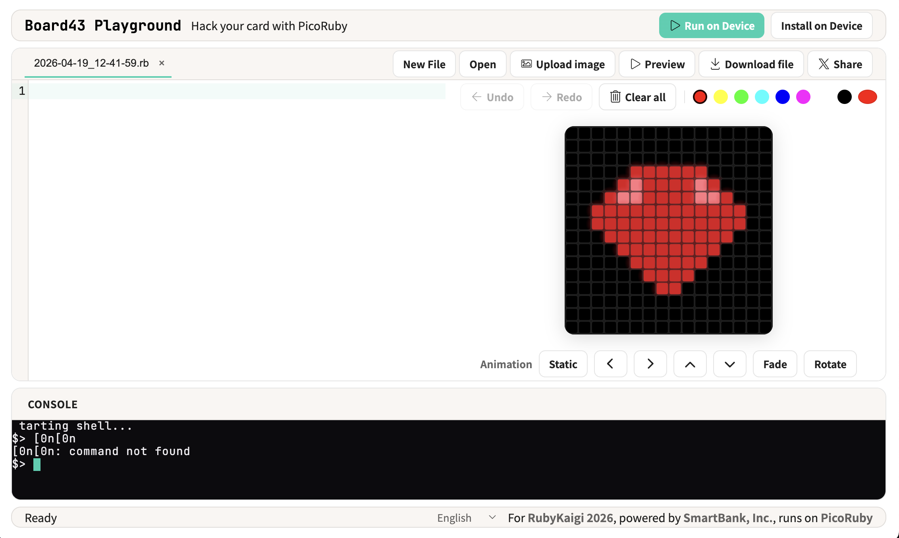
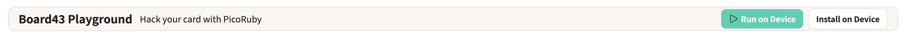
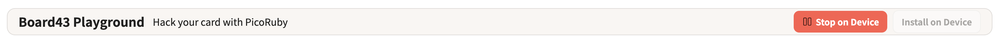
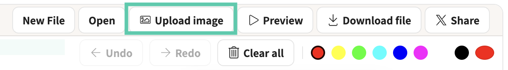
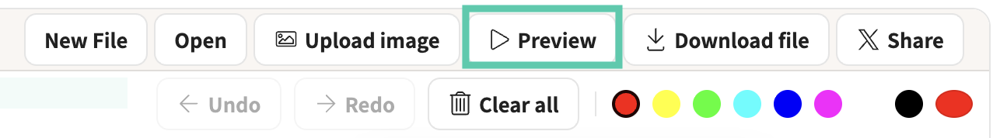

[日本語](README.md)

# Board43 Workshop: Display Your Icon on the LED Matrix

Use Board43 and PicoRuby to display pixel art on a 16×16 LED matrix.

## What You Need

- **Board43** — Yours to keep after the workshop
- **USB Cable Type-C** — Please return after the workshop
- **Your PC** — Use Chrome or Edge

---

## 1. Set Up the Tool

### 1-1. Connect Board43 to Your PC

Connect Board43 to your PC with the USB cable.

### 1-2. Open Board43 Playground

Open the following URL in your browser.

```
https://board43-playground.smartbank.workers.dev/
```

### 1-3. Connect via Serial

The setup screen will appear.

1. Leave the Baud Rate at **115200** and press the **Connect** button

   

2. Select the serial port in the browser dialog (choose the one labeled "PicoRuby R2P2")

   

The screen will switch to show a code editor on the left, an LED simulator on the upper right, and a console at the bottom.



---

## 2. Light Up the LEDs

### 2-1. Light All LEDs in Red

Enter the following code in the editor.

```ruby
require 'ws2812-plus'

led = WS2812.new(pin: Board43::GPIO_LEDOUT, num: 256)  # GPIO 24, 256 LEDs (16×16)
led.fill(255, 0, 0)   # Set all LEDs to red (R=255, G=0, B=0)
led.show              # Send the buffer to the LEDs
```

Press the **Run on Device** button at the top of the screen.



If the entire LED matrix lights up red, it's working.

Press **Stop on Device** before running the next code.



### 2-2. Change the Color of Specific LEDs

Use `set_rgb(index, r, g, b)` to control individual LEDs.

```ruby
require 'ws2812-plus'

led = WS2812.new(pin: Board43::GPIO_LEDOUT, num: 256)

led.set_rgb(0, 0, 255, 0)      # Top-left to green
led.set_rgb(15, 0, 0, 255)     # Top-right to blue
led.set_rgb(100, 255, 255, 0)  # Index 100 to yellow

led.show
```

LED indices start at `0` in the top-left corner, going left to right, top to bottom.

```
  0   1   2   3  ...  15
 16  17  18  19  ...  31
 32  33  34  35  ...  47
  :                    :
240 241 242 243  ... 255
```

---

## 3. Animate the LEDs

Use `clear` to turn off all LEDs, and `sleep_ms` to wait in milliseconds. Repeating "off → on → wait" in a `loop` creates animation.

```ruby
require 'ws2812-plus'

led = WS2812.new(pin: Board43::GPIO_LEDOUT, num: 256)

loop do
  256.times do |i|
    led.clear                   # Turn off all LEDs
    led.set_rgb(i, 255, 0, 0)   # Light up LED i in red
    led.show
    sleep_ms 30                 # Wait 30 milliseconds
  end
end
```

Press **Run on Device** to see a red light flowing from the top-left to the bottom-right.

The `sleep_ms` value sets the frame interval — smaller values make it faster, larger values make it slower.

Press **Stop on Device** at the top of the screen to stop the program.

---

## 4. Display Your Icon

This is the main part. Use the **LED Simulator** in the upper right to create pixel art and display it on Board43.

### 4-1. Upload an Image

1. Press the **Upload image** button in the editor toolbar

   

2. Select an image file
3. It will be automatically converted to 16×16 and displayed in the simulator

### 4-2. Add Animation

Choose a display mode from the simulator toolbar.


| Option | Motion          |
| ------ | --------------- |
| Static | Static display  |
| ←      | Scroll left     |
| →      | Scroll right    |
| ↑      | Scroll up       |
| ↓      | Scroll down     |
| Fade   | Fade in and out |
| Rotate | Rotate          |

### 4-3. Preview in the Simulator

Press the **Preview** button in the editor to auto-generate code and preview the animation in the simulator.



### 4-4. Transfer to Board43

Press the **Run on Device** button at the top of the screen to display it on the Board43 LED matrix.

### 4-5. Tilt the Board

Try flipping Board43 upside down. The icon orientation changes automatically. The code generated from the uploaded image includes accelerometer-based orientation detection.

### 4-6. Experiment Freely

Change the pixel art or animation and try as many times as you like. Keep experimenting until you're satisfied.

### 4-7. Auto-Run on Power Up

Press the **Install on Device** button at the top of the screen to save the current code as `/home/app.rb`. From next time, the LEDs will light up just by powering on. It works with a mobile battery without a PC connection. On boot, the status LED blinks 10 times before app.rb starts.

To disable auto-run, skip the auto-run first, then delete or rename app.rb.

1. Hold the **SW3** button on the board and press the **RUN** button to reboot
2. Keep holding **SW3** until the status LED flashes 3 times
3. Press **Connect** again in the Playground screen, then delete or rename app.rb from the console

```
mv /home/app.rb /home/old.rb
```

### 4-8. Share Your Code

Press the **Share** button in the editor toolbar to generate a shareable URL. You can copy the link or post it to X (Twitter). Opening the shared link will load the code in Board43 Playground.

---

## 5. What Board43 Can Do

Board43 has a 6-axis IMU (accelerometer + gyroscope), buzzer, and switches in addition to the LED matrix.

**Demo: Theremin (theremin.rb)**
Tilt the board to play a musical scale. The LED shows the current note position. Uses the IMU, buzzer, LED, and switches.

The sample code is available on GitHub. Try it on your own Board43.

https://github.com/smartbank-inc/Board43/tree/main/workshop/examples

### Other Features

**Editor Toolbar**

| Button   | Description                      |
| -------- | -------------------------------- |
| New File | Create a new file                |
| Open     | Open a file saved on Board43     |
| Download | Save the current file to your PC |

**Console**

The console is a PicoRuby shell. You can run commands directly from the terminal.

```
/home/my_program.rb   # Run a file
```

Press **Ctrl + C** to stop a running program.

```
ls /home          # List files
cat /home/app.rb  # Display file contents
mv /home/app.rb /home/old.rb  # Rename a file
```

---

## 6. Cleanup

Disconnect the USB cable and leave it on the desk. Please take Board43 home with you.

Please fill out the [survey](https://docs.google.com/forms/d/e/1FAIpQLSeV5AyQW6vzZo-vfc9GZmv4xTpa_p-nzMFEPl0KW-F13QeOgA/viewform). Your feedback will help us improve future workshops.

We'll be at this hack space after the workshop. We'd love to see what you've made. Feel free to ask questions too.

Sharing on social media is very welcome. We'd love it if you use the hashtag **#board43**.

---

## Troubleshooting

**LEDs don't light up**
→ Check that the USB cable is securely connected. If `>` appears in the console, the connection is working.

**The program won't stop**
→ Press the **Stop on Device** button at the top of the screen.

**Serial port not found**
→ Make sure you're using Chrome or Edge. Firefox and Safari don't support the Web Serial API.

**The screen is frozen**
→ Reload the browser and Connect again.

---

## License

[CC BY-SA 4.0](https://creativecommons.org/licenses/by-sa/4.0/), Attribution-ShareAlike 4.0 International.
